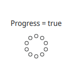

# QtColumnLayout

By working on to the Qt markup language, I personnaly like the way of what Qt is providing in order to make element next to each others through anchoring and also align them
by using the Layout.alignment property that is an enumeration related to the Layout the element is inside. In my case the layout is going to be a ColumnLayout, meaning that
this layout is about to make element on top of each others, and then make possible for the element to be at the top, or at the bottom without using the x / y of them.

## Preview

This project is all about the layout of a QML file layout, meaning that the "backend" of Qt (C++, Python, Java) is used only to display the QML content.

